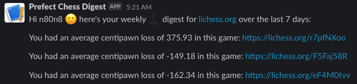

# weekly chess digest
**get a weekly slack message with links to your best chess games!**

## Example

```python

from weekly_digest import weekly_digest # this is a prefect flow

# if you have docker & python deps installed, this should ~ just work™️ ~
if __name__ == "__main__":
    weekly_digest(
        player=dict(username="n80n8", platform="chess.com"), # that's me!
        webhook_url_name="name-of-my-prefect-secret-holding-slack-webhook-url",

    )
```
Produces a slack message like this:




## How it works
`weekly_digest.py` defines a Prefect flow that runs an engine (like [stockfish](https://github.com/official-stockfish/Stockfish)) in order to calculate [centipawn loss](https://chess.stackexchange.com/questions/26469/average-centipawn-loss) on PGNs and sends the `top_N_games` by this metric to a Slack webhook url as a list of markdown [blocks](https://api.slack.com/block-kit).


## Setup
Requires python 3.10+ and deps in `requirements.txt`

### Auxilliary resources
- a chess engine (like stockfish) running at some path accessible to your machine, e.g. `opt/homebrew/bin/stockfish`
    - by default, the flow will attempt to run a docker container that already has Stockfish 15 installed,
    which means you need docker running on the machine thats running the flow
    - the engine will use two threads by default.
    - you can pass an `EngineConfig` to the `run_engine` context manager to specify a different engine location / # threads

- [Prefect secret](https://discourse.prefect.io/t/how-to-securely-store-secrets-in-prefect-2-0/1209) called `slack-digest-url` that stores your desired webhook URL (will potentially add NotifBlock in future) - [Prefect Cloud](https://app.prefect.cloud/) is free btw


### Setup venv
```bash
# miniconda for example
conda create -n pychess python=3.10 -y
conda activate pychess
pip install -r requirements.txt
```
